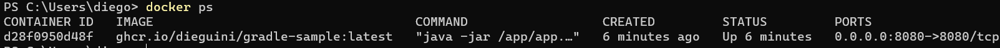
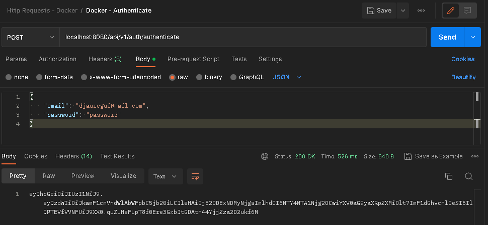
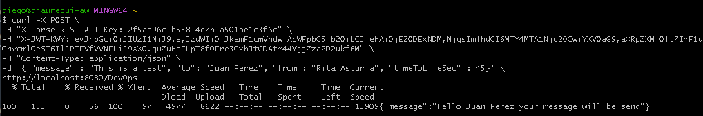
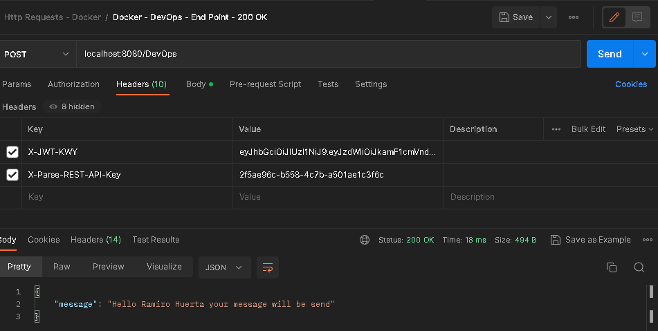
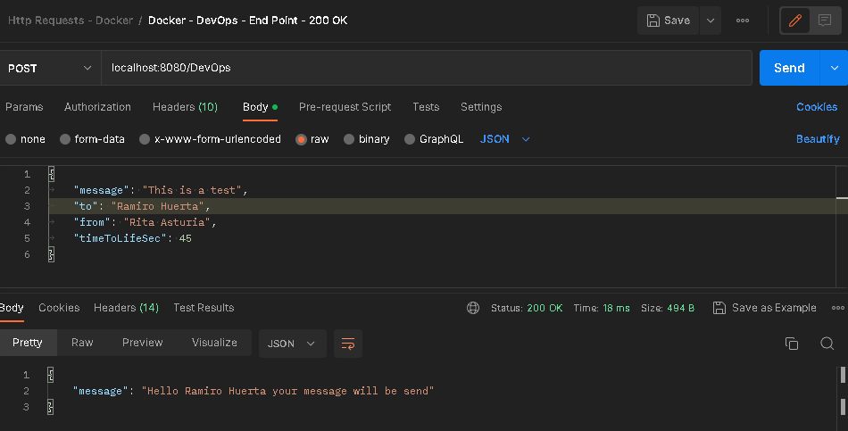

# Gradle-Sample

Gradle microservice project with next functionalities:

- Spring boot
- Spring Security
  - JWT Token
  - API Token
- Docker image
- CI-CD pipeline (Github Actions)
 
### Prerequisites

- Docker Engine

## Usage

### 1. Docker image

The image exists on two registries (Use any)

- [Docker Hub](https://hub.docker.com/repository/docker/g0l14t/gradle-sample/general)

```sh
docker run -dp 8080:8080 g0l14t/gradle-sample:latest
```

- [Github Registry](https://github.com/dieguini/Gradle-Sample/pkgs/container/gradle-sample/82199633?tag=latest)

```sh
docker run -dp 8080:8080 ghcr.io/dieguini/gradle-sample:latest
```

<ins>Result</ins>



### 2. JWT Token Access

For the sake of this demo, the app contains a _pre-load_ user that to get the JWT Token

- **User**: djauregui
- **Password**: password (Never do this! Just for demo)

<ins>Result</ins>


 
### 3. Curl Verification

Access endpoint

```sh
curl -X POST \
-H "X-Parse-REST-API-Key: 2f5ae96c-b558-4c7b-a501ae1c3f6c" \
-H "X-JWT-KWY: <YOUR-JWT-TOKEN>" \
-H "Content-Type: application/json" \
-d '{ "message" : "This is a test", "to": "Juan Perez", "from": "Rita Asturia", "timeToLifeSec" : 45}' \
http://localhost:8080/DevOps
```

<ins>Curl Result</ins>



<ins>Postman Result</ins>


